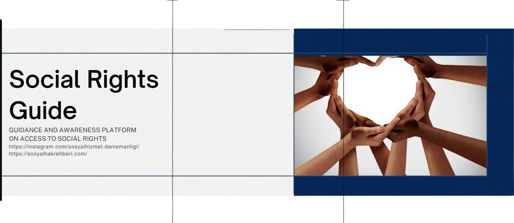

# Sosyal Hak Rehberi – Digital Social Rights Guidance Platform



Frontend repository of **https://sosyalhakrehberi.com/**

A public-oriented digital platform that helps individuals understand and access their social rights in Turkey.

- Website: https://sosyalhakrehberi.com/
- Instagram: https://www.instagram.com/sosyalhizmet.danismanligi/
- Contact: info@sosyalhizmetdanismani.com

---

## 🌍 What is this?

Sosyal Hak Rehberi is a guidance and awareness platform designed to make social rights:

- understandable
- accessible
- actionable

It helps users:

- learn which benefits they may be eligible for
- understand decision logic clearly
- take the correct next steps

> This platform provides guidance only and is not an official government decision system.

---

## 🎯 Why it exists

Many individuals:

- do not know their rights
- apply incorrectly and get rejected
- cannot navigate complex bureaucratic processes

This platform aims to:

- reduce failed applications
- increase awareness of rights
- provide structured guidance

---

## 🌍 Social Impact & Context

Access to social rights remains a significant challenge.

According to official public reports and national statistics:

- millions of individuals benefit from social assistance programs in Turkey
- a large number of applications are incomplete or incorrectly submitted
- many eligible individuals cannot access benefits due to lack of guidance

These challenges create:

- unnecessary administrative workload for institutions
- delayed or rejected applications
- loss of access to essential support

---

## 🎯 Mission

To provide a clear, structured, and accessible digital guidance system  
that helps individuals understand their social rights and take the correct actions.

---

## 🚀 Vision

To build a scalable Social Rights Operating System that:

- improves awareness of rights
- reduces incorrect applications
- supports efficient public service processes
- enables fair access to benefits

---

## ⚖️ Public Value

This platform acts as a digital social rights guide by:

- empowering individuals with knowledge
- supporting fair access to public resources
- reducing friction between citizens and institutions

---

## ⚙️ How it works

1. User starts a guided test
2. Inputs basic information
3. Frontend sends request to backend
4. Backend evaluates eligibility
5. Frontend renders:
   - decision
   - explanation
   - next steps

---

## 🧩 Product Position

- `SocialRightOS` → backend decision engine
- `sosyalhakrehberi-web` → public frontend

The frontend is the:

- SEO layer
- UX layer
- conversion layer

The backend is the:

- source of truth
- eligibility logic layer
- policy rules layer

---

## ❗ Core Principle

> Backend decides, frontend renders.

Frontend:

- does **not** calculate eligibility
- does **not** store thresholds
- does **not** interpret rules

---

---

## 🔍 Example Output

```json
{
  "decision": "eligible",
  "confidence": "high",
  "rule_trace": [
    "income_below_threshold"
  ],
  "next_step": "Apply via local office"
}
📈 Scaling and Sustainability

Each guided test triggers backend processing.

As usage grows:

API load increases
infrastructure cost increases

To sustain the platform, these layers must continue operating reliably:

backend engine
hosting
development
maintenance
💖 Supporting the Project

This is a public-benefit system.

Support helps us:

keep it free
improve quality
reach more people
🤝 Contributing

Use Issues for:

bugs
policy updates
improvements
💬 Community

Use Discussions for ideas and feedback.

🖼️ Project Identity

Technical Documentation
Tech Stack
Next.js
React
TypeScript
Local Development
npm ci
npm run dev
License

This repository is proprietary and distributed under an All Rights Reserved notice.
See LICENSE
.